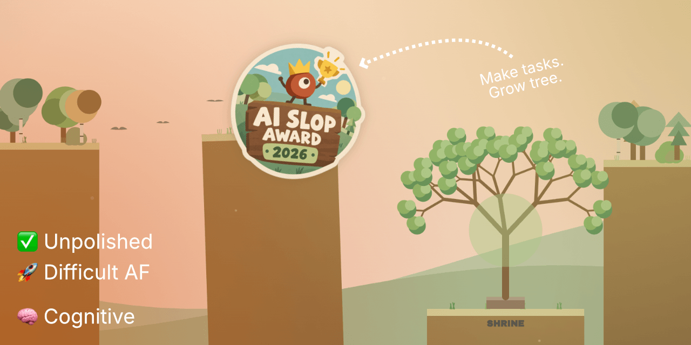
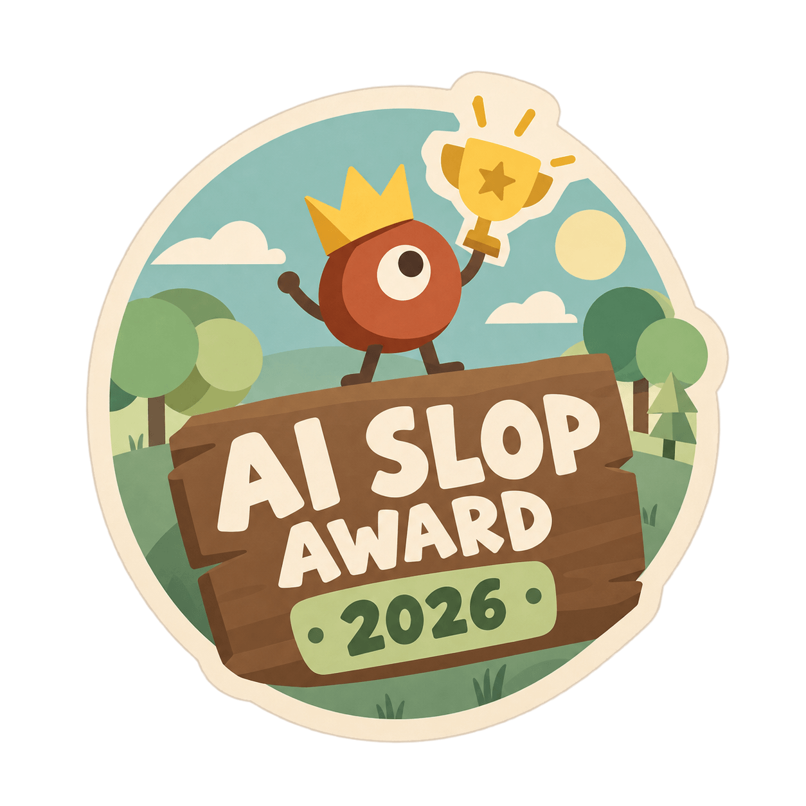

# Voice Checklist – Jump & Run

Vibe-coding tech demo to explore the web speech API and how far a one-shot AI prompt can go.
When would a complex application degrade into a buggy mess?

Expect a weirdly over-complicated UI and game experience. Quite some frustration. Maybe a bit fun.

Try it live: [LOVABLE](https://codeconut-gamified-voice-checklist.lovable.app)

---

## Mechanics

- Run around with the character and try to reach the UI interfaces, at the left/ right game field corners.
- Collected points can be exchanged at the central tree to let it grow.
- Don't get touched by the sun.
- Random world generation for visual effect only.

_Tip: The character can double-jump._

---

## Known issues

Ignored for now:

- Hit detection is not perfect for moving obstacles
- Parallax background moves oddly with character
- Movement is really difficult to control

---

## Disclaimer

> [!TIP]
> 90% AI generated, 5% effort – 5% love

Nothing has been adjusted or polished. But it would be cool if it were – with a solid
human touch at its core (this is a tech demo, not even a prototype or more).

---

## Fan goodies

In case you urgently need it for something.

---

_Code by Lovable. Slop award by ChatGPT. README by human._
